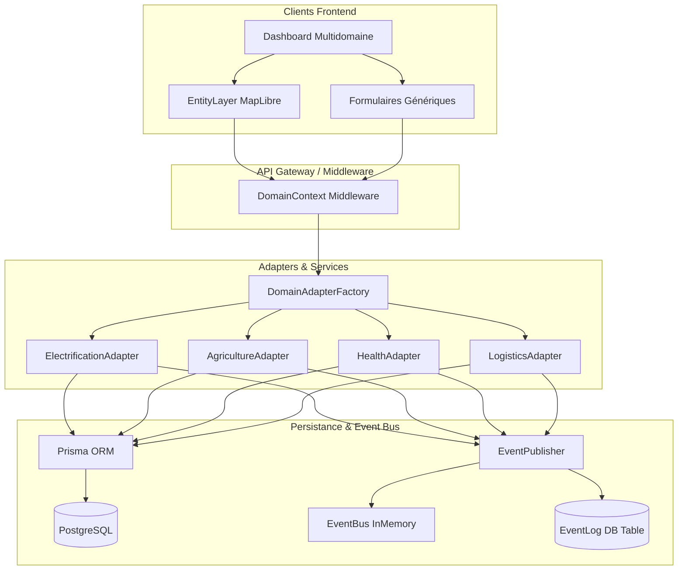

# Architecture Multidomaine GED OS

Ce document présente l'architecture technique unifiée de **GED OS**, conçue pour faire évoluer le produit historique électrification (GEM) vers une plateforme universelle capable d'orchestrer n'importe quel domaine d'impact (Santé, Agriculture, Logistique, Réseaux Haute Tension, Solaire Mini-grids, Ciblage Éligibilité, Collecte de Données, etc.).

---

## 1. Vue d'Ensemble & Principes Fondamentaux

L'architecture repose sur trois piliers d'abstraction :
1. **DomainConfig (Base de données / Configuration)** : Configuration descriptive stockée en base par domaine.
2. **DomainAdapter (Logique métier / Normalisation)** : Abstraction normalisée garantissant des interfaces uniformes.
3. **EventPublisher & EventBus (Événementiel / Asynchronisme)** : Messagerie découplée en temps réel et persistence d'audit.



---

## 2. Modèle de Données Dynamique : `DomainConfig`

La table `DomainConfig` stocke les configurations sémantiques, les schémas de validation et les modèles spécifiques à chaque domaine. Cela évite le codage en dur et permet d'ajouter des champs personnalisés dynamiquement par organisation.

```prisma
model DomainConfig {
  id                    String   @id @default(uuid())
  organizationId        String
  domainType            String   // "electricity", "agriculture", "health", "logistics", etc.
  
  // Configuration des entités
  entityFields          Json     // Champs monitorés (ex: ["beds", "staff", "weeklyPatients"])
  statusEnum            String[] // États possibles (ex: ["operational", "understaffed", "critical_shortage"])
  priorityRules         Json     // Règles d'alerte et de gravité
  validationSchemas     Json     // Schémas JSON Schema de validation
  
  // Templates de processus
  projectTemplates      Json     @default("[]")
  missionTemplates      Json     @default("[]")
  metadata              Json     @default("{}")
  createdAt             DateTime @default(now())
  updatedAt             DateTime @updatedAt
  organization          Organization @relation(fields: [organizationId], references: [id], onDelete: Cascade)

  @@unique([organizationId, domainType])
  @@index([organizationId])
  @@index([domainType])
}
```

---

## 3. Le Pattern `DomainAdapter`

Le `DomainAdapter` est l'interface abstraite unifiant la validation, la normalisation, le calcul d'état et le déclenchement d'alertes pour toutes les entités de l'écosystème.

```javascript
export abstract class DomainAdapter {
  abstract domainType: string;
  
  // Normalisation des payloads bruts en entités typées
  abstract normalizeEntity(rawData: any): Promise<any>;
  
  // Validation stricte du modèle d'entité
  abstract validateEntity(entity: any): ValidationError[];
  
  // Détermination de l'état fonctionnel de l'entité
  abstract deriveStatus(entity: any): string;
  
  // Analyse de données et génération automatique d'alertes
  abstract generateAlerts(entity: any): Alert[];
  
  // Récupération des attributs de l'entité
  abstract getEntityFields(): string[];
}
```

### Exemple : `HealthAdapter`
L'adaptateur Santé calcule l'état opérationnel et lève des alertes critiques en cas de manque d'effectif médical ou de rupture de stock de médicaments :

```javascript
export class HealthAdapter {
    constructor() {
        this.domainType = 'health';
    }
    // ... normalisation ...
    
    deriveStatus(entity) {
        const { beds, staff, medications } = entity.domainData || {};
        if (!staff || staff.length === 0) return 'unstaffed';
        
        const meds = medications || {};
        const criticalShortage = Object.values(meds).some((qty) => qty === 0);
        if (criticalShortage) return 'critical_shortage';
        if (!beds || beds < 2) return 'understaffed';
        
        return 'operational';
    }

    generateAlerts(entity) {
        const alerts = [];
        const d = entity.domainData || {};
        if (!d.staff || d.staff.length === 0) {
            alerts.push({
                type: 'no_staff',
                severity: 'critical',
                message: 'Le centre de santé n\'a pas de personnel médical enregistré.',
            });
        }
        return alerts;
    }
}
```

---

## 4. Messagerie Événementielle : `EventPublisher` & `EventBus`

Tous les modules GED OS publient des événements standardisés via la classe `EventPublisher`. Cela assure :
1. Une réactivité en temps réel via un bus mémoire Node (`EventEmitter`).
2. Une traçabilité durable par persistance synchrone ou asynchrone dans la table `EventLog`.

### Modèle `EventLog`
```prisma
model EventLog {
  id             String       @id @default(uuid())
  projectId      String?
  organizationId String
  userId         String?
  type           String       // ex: "health:center_created"
  resource       String       // ex: "healthCenter"
  resourceId     String?
  data           Json?
  metadata       Json?
  createdAt      DateTime     @default(now())
}
```

### Publication d'un Événement
```javascript
import EventPublisher from './EventPublisher.js';

await EventPublisher.publish({
  organizationId: req.user.organizationId,
  projectId: req.projectId,
  userId: req.user.id,
  type: 'agriculture:field_created',
  resource: 'field',
  resourceId: field.id,
  data: { field }
});
```

---

## 5. Guide d'Ajout d'un Nouveau Domaine en 2 Heures

Pour ajouter un nouveau domaine d'impact, par exemple l'Éducation (`education`), suivez cette procédure standardisée :

### Étape 1 : Définir les tables Prisma (optionnel si données purement dynamiques)
Si vous avez besoin de structures physiques spécifiques comme `School` :
```prisma
model School {
  id             String                   @id @default(uuid())
  organizationId String
  projectId      String?
  name           String?
  status         String                   @default("operational")
  location       Json?
  domainData     Json?                    @default("{}")
  alerts         Json?                    @default("[]")
  createdAt      DateTime                 @default(now())
  updatedAt      DateTime                 @updatedAt
}
```
*Exécuter `npm run prisma:generate && npm run prisma:push` pour synchroniser la base.*

### Étape 2 : Créer l'Adaptateur
Créez `backend/src/domain-adapters/adapters/EducationAdapter.js` :
```javascript
export class EducationAdapter {
  constructor() {
    this.domainType = 'education';
  }
  async normalizeEntity(rawData) { ... }
  validateEntity(entity) { ... }
  deriveStatus(entity) { ... }
  generateAlerts(entity) { ... }
  getEntityFields() { return ['classrooms', 'teachers', 'students']; }
  getOptimalQueryShape() { ... }
}
```
*Enregistrez l'adaptateur dans `backend/src/domain-adapters/DomainAdapterFactory.js`.*

### Étape 3 : Créer le Service, Contrôleur et Routes
1. **Service (`EducationService.js`)** : Gère la logique de création et publie l'événement `education:school_created`.
2. **Contrôleur (`schools.controller.js`)** : Expose le CRUD.
3. **Routes (`schools.routes.js`)** : Montez les endpoints en utilisant le middleware `verifierModule('education')`.

### Étape 4 : Déclarer le Module Frontend
1. Créez `frontend/src/modules/education/manifest.ts` et configurez les routes de navigation, l'icône, le rôle requis et la catégorie (`'OPÉRATIONS'`).
2. Créez la vue principale `Schools.tsx` en utilisant le composant générique `EntityLayer` avec la propriété `domainType="custom"` (ou configurez une nouvelle couleur de domaine).
3. Enregistrez le manifest dans `frontend/src/core/kernel/registry.ts`.

---

Grâce à ce socle d'abstraction robuste, GED OS offre une flexibilité totale, permettant d'adopter de nouveaux secteurs d'activité avec un coût technique minimal et une robustesse de niveau production.
